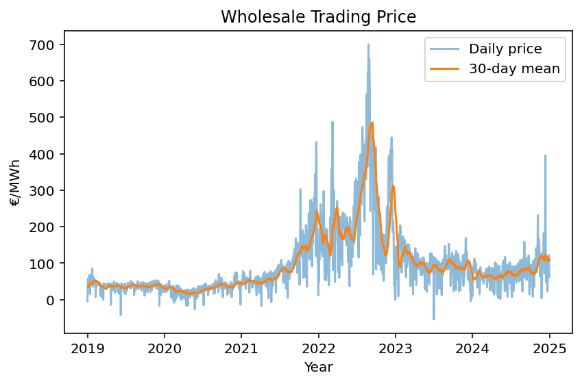
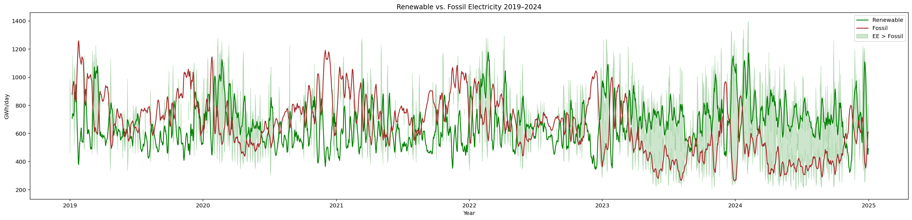
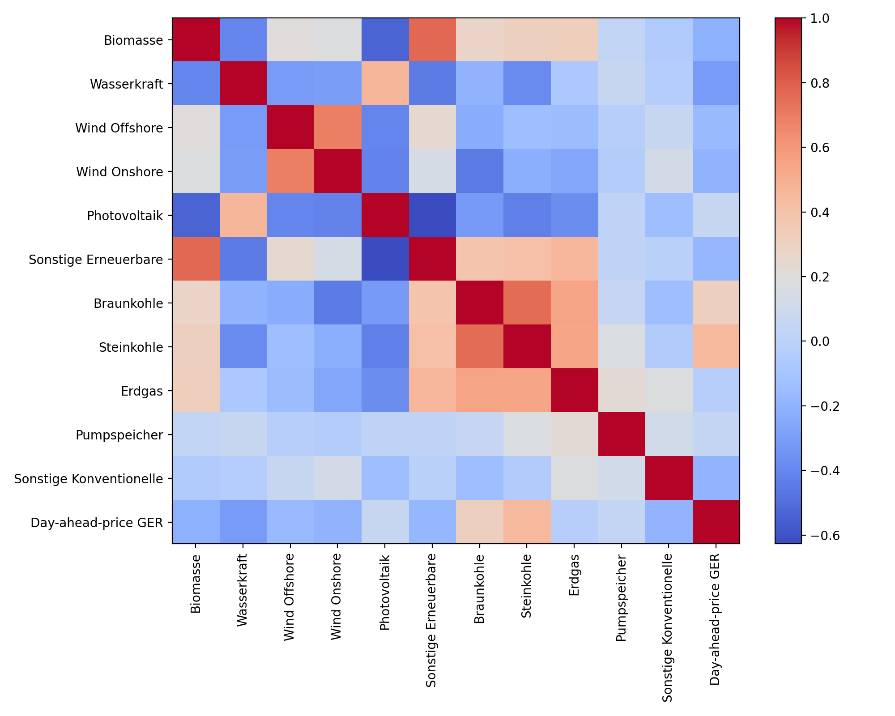
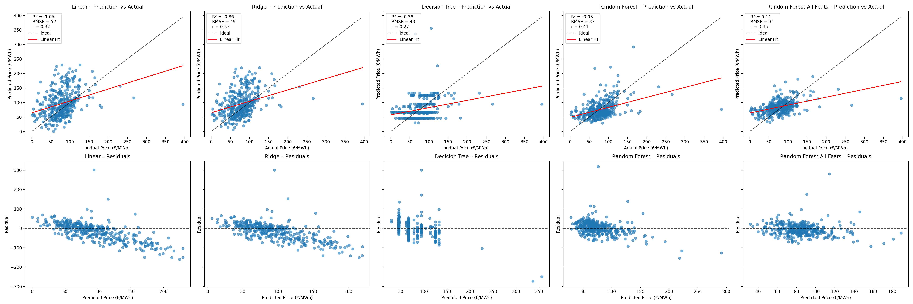

# smard-analysis
Showcase project to visualize and analyze data from SMARD; electricity and price forecasting

## Project Goals

The expansion of renewable energy is a crucial component in energy transition toward a more sustainable economy and society. This project serves as a **personal showcase** for:
- Time-series-based data preprocessing
- Clear exploratory visualizations
- End-to-end machine learning workflows
- Exploring the relationship between electricity generation and wholesale prices
- Implementing and evaluating forecast models for day-ahead electricity prices

## Data Sources

The data used in this project are downloaded from SMARD-Bundesnetzagentur (https://www.smard.de/home/downloadcenter/download-marktdaten/)
License CC BY 4.0 - source: Bundesnetzagentur | SMARD.de
That is, the data are allowed to be shared and adapted for any purposes, including commercial puposes.

## Exploratory Data Analysis

### 1. Wholesale Price Trend

Between 2019 and 2020, the wholesale prices remained relatively constant. Prices increased in 2021, and sharply in 2022, reaching a peak in the second half of 2022, primarily because of gas price crisis caused by the Russian war against Ukraine. Since 2023, the prices dropped significantly and went up moderately in the second half of 2024.

---

### 2. Renewable vs. Fossil Electricity

During summer months, renewable electricity generation often exceeded fossil generation.
- 2019 - 2024: On 1,087 out of 2,192 days, (49,5%), renewables generated more electricity than fossils sources.
- 2023 - 2024: Increase to 562 of 731 days (76,9%)
Thus, we see a clear trend in increasing renewable energy generation, while some periods with low renewable output still occured, e.g. in late 2024 (white gaps between bright-green areas).

---

### 3. Correlation Matrix

Pearson's r - Top 3 correlations with day-ahead price:
- Steinkohle ~ Price: +0.45
- Braunkohle ~ Price: +0.313
- Wasserkraft ~ Price: -0.313

Thus, Stein- and Braunkohle correlate weakly **positive** with day-ahead price, while Wasserkraft correlates weakly **negative**.

Other notable correlations:
- Steinkohle ~ Braunkohle: +0.75
- Biomasse ~ Sonstige Erneuerbare: +0.77
- Wind Onshore ~ Wind Offshore: +0.70

Fossil energy sources show moderate till strong correlations with each other. Among renewable energy sources, strong correlations are visible between the two wind sources and between Biomasse and Sonstige Erneuerbare.

Feature selection based on correlation thresholds to avoid multicollinearity:
- |corr(feature, target)| >= 0.2
- |corr(feature1, feeature2)| < 0.5 

resulted in the following features:
['Steinkohle [GWh]', 'Wasserkraft [GWh]', 'Biomasse [GWh]', 'Wind Onshore [GWh]']
-> renewable as well as fossil electricity sources

These features were used as input for the following models:

1) Linear Regression
2) Ridge Regression
3) Decision Tree (Hyperparameter optimization)
4) Random Forest (Hyperparameter optimization)
5) Multilayer Perceptron (in progress)

All modelling and evaluation steps are implemented in 'train_eval_models.py'.

---

## Model Evaluation

Among the evaluated models, only the random forest (all fatures included except 'Kernenergie') reached a positive determination coefficient (R²=0.14). That is, all other models perform worse than a baseline model which takes the mean price (2019-2023) as predicted value and the andom forest shows a slight improvement over such a dummy regressor.

The root mean squared error (RMSE) improves across the models:
- Linear Regression: ~ 52€/MWh
- Random Forest: ~ 34 €/MWh

suggesting that non-linear models outperform linear approaches in predicting electrictiy prices.

Ideas for Improvement:
- Feature engineering: Include other features such as weather data, electricity demand, import/export information and apply temporal aggregation/sliding window methods.
- Advanced train-test split: Replace the static train-test split with 2024 as test dataset with adavenced split methods such as TimeSeriesSplit.
- Alternative models: Consider non-linear models, e.g. XGBoost or deep learning approachs, e.g. multi-layer perceptrons.